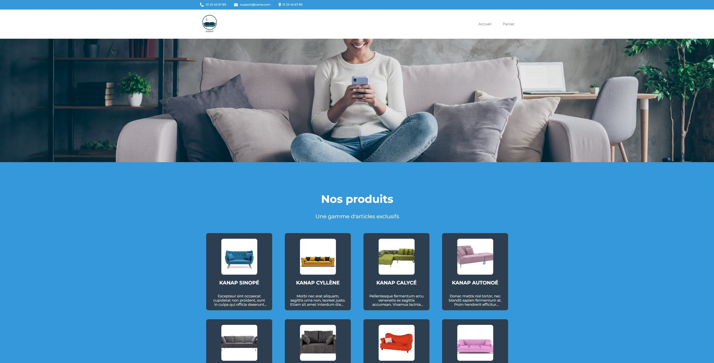
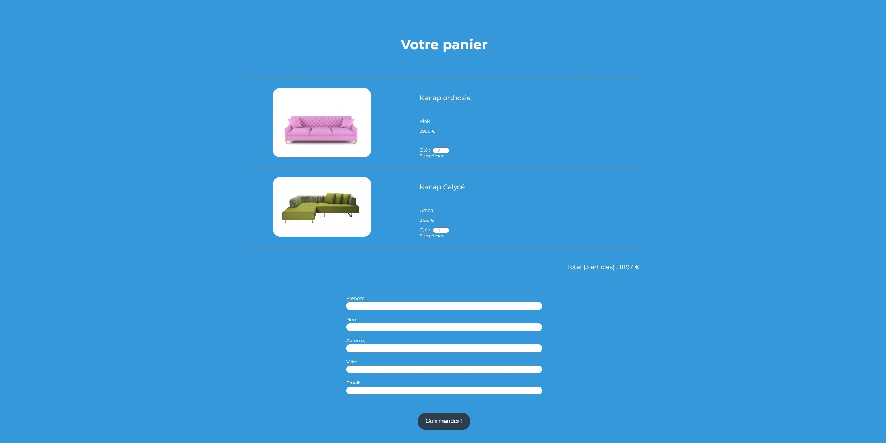

# Formation développeur web 


## 📎 Projet 5 : Kanap


  




## Technologies :
- HTML
- CSS
- JS

  
 
 ## Tester le projet :

```terminal
git clone https://github.com/Cyril-Develop/Kanap.git
```

## Installation :

`Node` et `npm` doivent être installés localement sur votre machine.\
Installez toutes les dépendances avec npm.

Ouvrez le répertoire `back` depuis le terminal, puis :
```terminal
npm install
```

Pour lancer le server :
```terminal
node server
```
