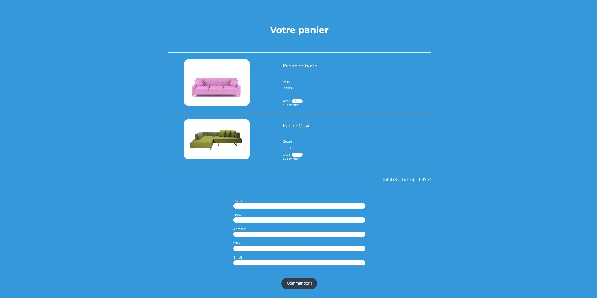

# Formation développeur web 


## 📎 Projet 5: Kanap


  




## Technologies :
- HTML
- CSS
- JS

  

### Installation :

`Node` et `npm` doivent être installés localement sur votre machine.\
Installez toutes les dépendances avec npm.

Ouvrez le répertoire `back` dans le terminal :
```terminal
npm install
```

Puis lancer le server avec `node server`.

## Tester le projet :

```terminal
git clone https://github.com/Cyril-Develop/Kanap.git
```
